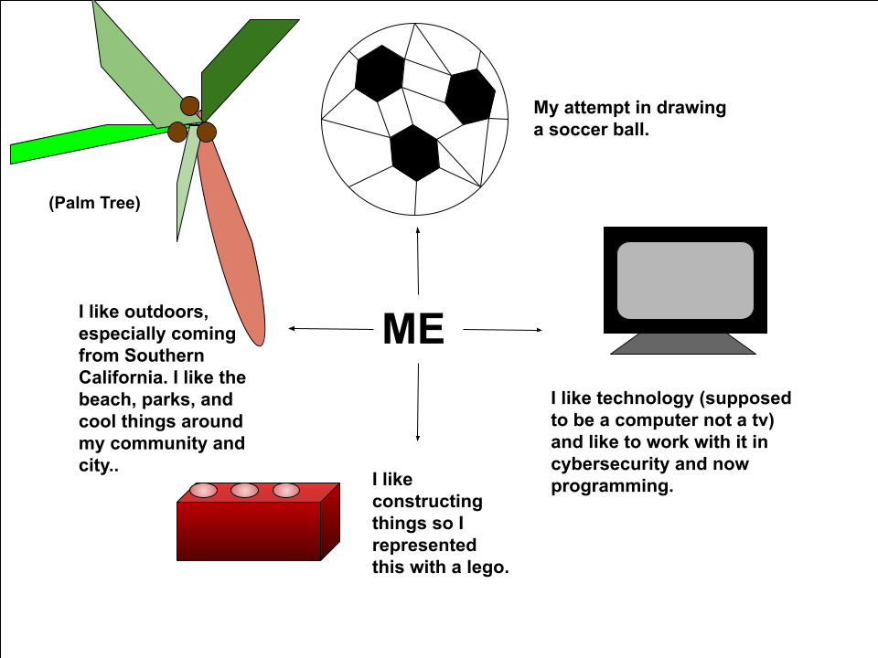

## Welcome to my blog!

## About Me

 _______________________ 
< My name is **Aditya Desai**. >

 -----------------------
    \   ^__^
     \  (oo)\_______
        (__)\       )\/\
            ||----w |
            ||     ||

I am a student from Del Norte High School and a programmer taking the AP CSP course.

Here is an image that shows a little more about me:

 

## More About Me

 Soccer is my favorite sport, here is a clip that explains why: **[MESSI](https://youtu.be/k0O8439R9co)**

  
Besides that, if curious here is my schedule for school Tri1:

  
1. Honors Humanities with Mrs. Philyaw

2. AP CSP with Mr. Mortensen

3. AP Calc with Mrs. Hightower

4. AP Chem with Mr. Ozuna

5. Physics with Mr. Millman

## Extra Addons

<iframe width="560" height="315" src="https://www.youtube.com/embed/b79pcajaZNY" frameborder="0" allowfullscreen></iframe>

A nice youtube video from my friend Aditya Ramesh, go check his youtube channel!
 
Thanks for reading my page!

## Overview of Hacks, Study and Tangibles
Blogging in GitHub pages is a way to learn and code at the same time.
- Plans, Lists, [Scrum Boards](https://clickup.com/blog/scrum-board/) help you to track key events, show progress and record time.  Effort is a big part of your class grade.  Show plans and time spent!
- [Hacks(Todo)](https://levelup.gitconnected.com/six-ultimate-daily-hacks-for-every-programmer-60f5f10feae) enable you to stay in focus with key requirements of the class.  Each Hack will produce Tangibles.
- Tangibles or [Tangible Artifacts](https://en.wikipedia.org/wiki/Artifact_(software_development)) are things you accumulate as a learner and coder. 
